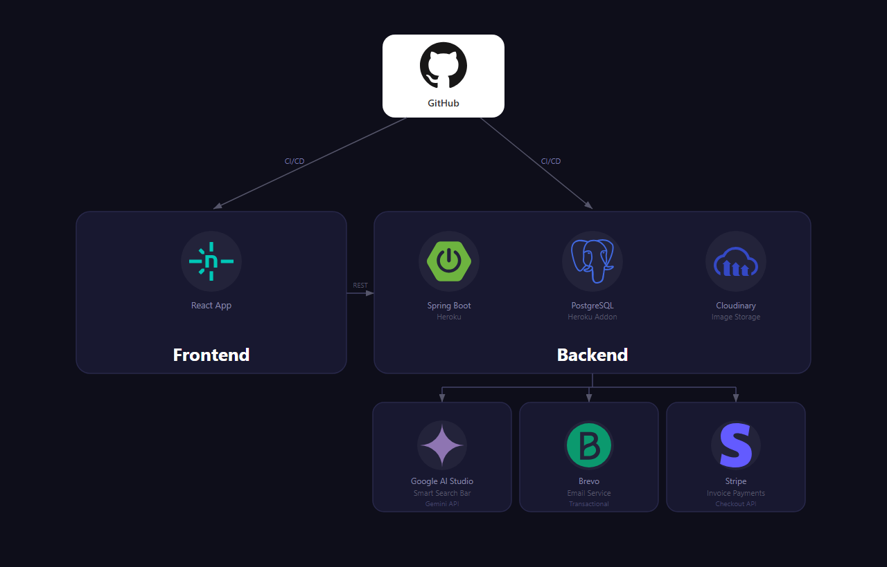
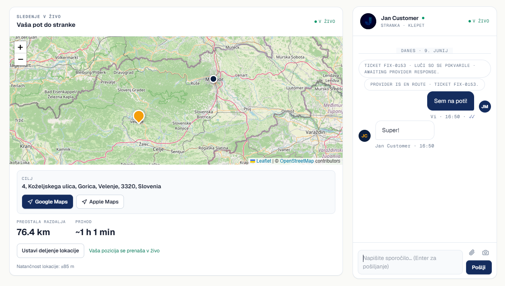
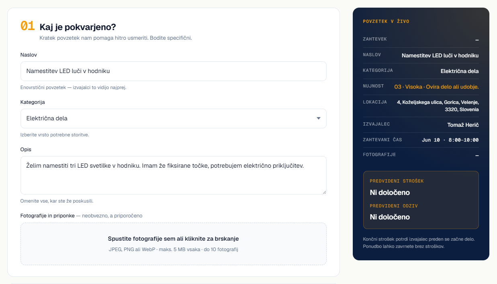
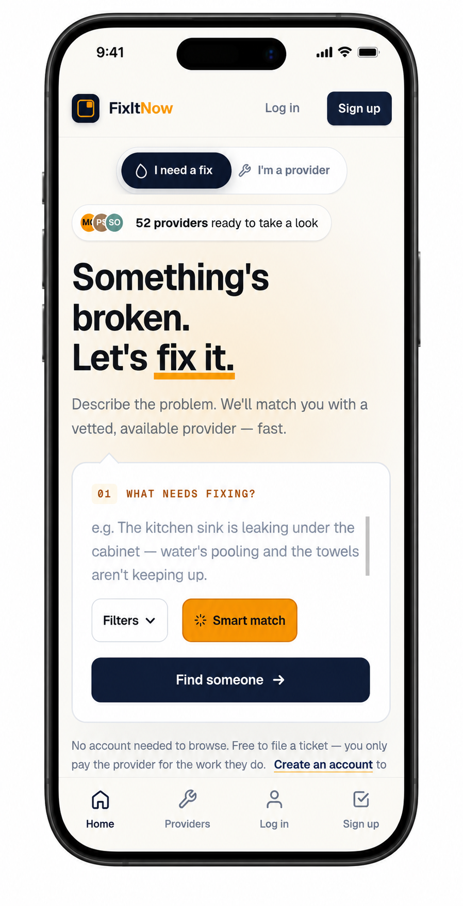
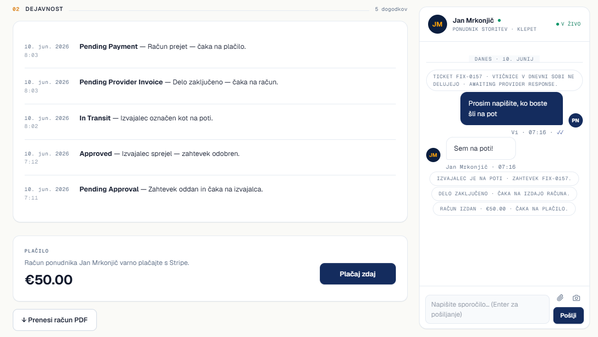

<div align="center">

# FixItNow 

**Report it. Track it. Fixed.**

An online marketplace that connects customers with trusted local service providers.

[](https://react.dev)
[](https://spring.io)
[](https://www.postgresql.org)
[](https://fixitnow.si)
[](../../pulls)

[🌐 fixitnow.si](https://fixitnow.si) · [🐛 Report a bug](../../issues) · [🤝 Contribute](#-contributing)

</div>

---

## What is FixItNow?

**FixItNow** brings households and tradespeople together in one place. A customer submits a repair request (e.g. plumbing, electrical, cleaning), the system matches them with a suitable provider nearby, and the whole flow — from agreement through live chat to payment — happens inside the app. It solves the problem of slow and opaque searching for reliable help.

## User roles

FixItNow has three kinds of users, each with their own view of the app:

- **Customer** — reports a problem as a request, gets matched with a nearby provider, chats and tracks the provider's arrival live, and pays for the completed job by card.
- **Provider** — the tradesperson (plumber, electrician, handyman, etc.) who browses and accepts requests in their service area, schedules and does the work, communicates with the customer, and receives payouts.
- **Administrator** — moderates the platform from an admin dashboard: manages users and providers, oversees requests, and keeps the marketplace running smoothly.

## Key features

- **Requests** — submit, track status, and view repair history
- **Smart search** — AI classification of the problem description + filters by trade, location, and price
- **Proximity matching** — match providers by category and service radius
- **Live chat** — messages, attachments, edit and delete
- **Live location (GPS)** — track the provider's arrival in real time
- **Invoices & payments** — issue invoices, pay by card (Stripe), payouts
- **Reviews & ratings** for completed jobs
- **Notifications and transactional email**
- **Roles** — customer, provider, administrator (with an admin dashboard)
- **Dark mode, bilingual (SL / EN), and PWA** (installable app)

## Tech stack

| Layer | Technology |
|-------|------------|
| Frontend | React, TypeScript, Vite, PWA |
| Backend | Java, Spring Boot, REST API |
| Database | PostgreSQL |
| Smart search | Google Gemini API |
| Payments | Stripe |
| Email | Brevo |
| Image storage | Cloudinary |
| Infrastructure | Heroku, GitHub Actions (CI/CD) |

## Project architecture

The repository consists of two independent modules that communicate over a REST API:

```
FixItNow/
├── frontend/   # React application (user interface, PWA)
└── backend/    # Spring Boot API (business logic, database, integrations)
```

Per-module details:
- [frontend/README.md](frontend/README.md)
- [backend/README.md](backend/README.md)

## Installation & running

### Prerequisites

- **Java 21** and **Maven**
- **Node.js 18+** and **npm**
- **Docker** (for the PostgreSQL database)

### 1. Clone the repository

```bash
git clone https://github.com/Luscsus/FixItNow.git
cd FixItNow
```

### 2. Start the database (PostgreSQL in Docker)

The backend ships with a `docker-compose.yml` that runs PostgreSQL 16 in a container.

```bash
cd backend
cp .env.example .env        # create your local config (edit secrets as needed)
docker compose up -d        # start PostgreSQL on port 5432
```

> Check it's running with `docker compose ps`. Data is kept in a Docker volume, so it survives restarts.

### 3. Run the backend

In the same `backend/` directory:

```bash
mvn spring-boot:run         # API on http://localhost:8080
```

Flyway applies the database migrations automatically on first start.

### 4. Run the frontend

In a **second terminal**, from the repository root:

```bash
cd frontend
npm install
npm run dev                 # app on http://localhost:5173
```

### 5. Open the app

Visit **http://localhost:5173** in your browser. 

> The integrations (Stripe, Brevo email, Gemini smart search, Cloudinary) stay disabled until you add their keys to `backend/.env`. See the [backend README](backend/README.md) for the full list.

## Deployment diagram



## Screenshots

<div align="center">

| Desktop | Desktop |
|:---:|:---:|
|  |  |

 

</div>

## Contributing

Contributions are welcome! Create a branch (`feature/name`), commit your changes, and open a Pull Request. For bugs and suggestions, use [Issues](../../issues).

## Links

- **Live app:** [fixitnow.si](https://fixitnow.si)
